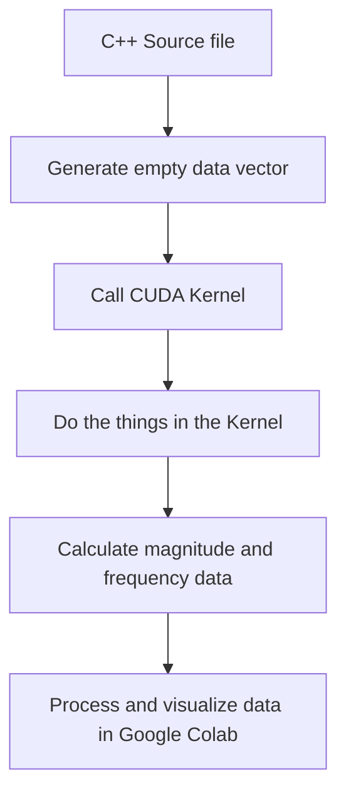
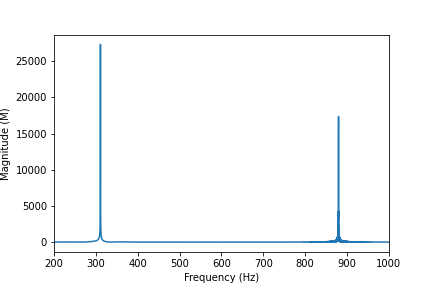
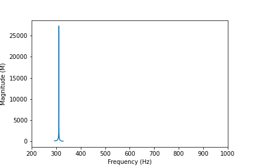
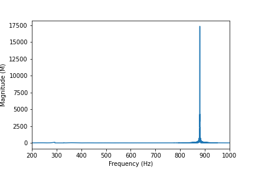
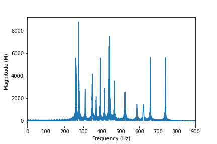
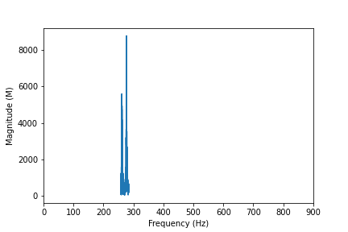
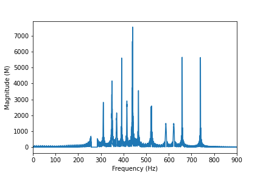

# Audio Parsing with CUDA
Lydia Calderon-Aceituno | Michael Laramie | Owen Foster

# Purpose and goals 
The main goal of this project is to be able to separate and isolate specific sections of an audio file (such as voices or notes), and write those to separate files. In order to do this, a fourier transform must be implemented on the GPU.
Goals:
- make `.wav` files readable as data
- implement Real to Complex transformation
- manipulate magnitude values to isolate specific frequencies
- isolate specific voices within an audio clip
- implement Complex to Real transformation
- write data out as an audio file

# Assumptions made
It is assumed that users know how to set up and run a CUDA project, and how to correctly load audio files into the project in order to perform the parsing. 

# How it works 
## Audio library 
We incorperated an [external library for processing audio files](https://github.com/adamstark/AudioFile/blob/master/AudioFile.h), written by Adam Stark. This which enabled us to load `.wav` files into our project and also gave us access to other important parameters including the sampling rate of the data and the size of the dataset itself.
## CuFFT library 
We also used [cuFFT](https://docs.nvidia.com/cuda/cufft/index.html), the CUDA Fast Fourier Transform library. This allowed us to take $n$ audio data points and pass them through a real-to-complex transform to generate $n+1$ complex numbers $z_n = a_n+b_ni$ where $a_n$ are the the $\cos(x)$ contributions in the signal and $b_n$ are the the $\sin(x)$ contributions in the signal.

## Theory 
Sound waves have a magnitude (how loud it is), and a frequency (the pitch). Integrating AudioFile.h and cuFFT, we were able to transform an audio signal into a dataset of complex Fourier coefficients. 

The magnitude of the signal over time is a $n$ sized vector containing 

$M_n = \sqrt{Re(z_n)^2 + Im(z_n)^2} = \sqrt{a_n^2 + b_n^2}$, 

where $M_n$ is the magnitude of the $n^{\mathrm{th}}$ data point. The frequency is a linearly spaced vector from $0$ to $\frac{1}{2 T}$, 

$f = \mathrm{linspace}(0, \frac{1}{2 T}, \mathrm{numpoints})$,

where $\mathrm{numpoints}$ is the number of data points in our sample and period $T$ is the inverse of our sampling rate. 

## Key variables 
**NEEDS FILLING OUT !!**
| Variable name | Type | Use|
|---------------|------|----|
| a | AudioFile<`float`> | vector of vectors used to represent the audio file |
| size | `int` | size of audio file data, crucial to Fourier transform |
| test | vector<`float`> | stores magnitude of complex data points, determines range of slice |
| hostInputData | cufftReal* | the real data submitted to R2C FFT |
| hostOutputData | cufftComplex* | the complex data returned from R2C FFT |

## Program flow

**NEEDS FILLING OUT !!**

*(to generate the graph, please install the "Markdown Preview Mermaid Support" extension in VS code)*

# Results 
We performed two major trials and visualized our results using a Jupyter notebook in Google colaboratory.

## Simple trial
After performing a FFT on a sample of two superimposed sine waves at $311.127\ \mathrm{Hz}$ and $???\ \mathrm{Hz}$, we produced the following graph 

We isolated the signals as visualized below:

These collections of data points were then recast as `cufftReal` **(IS THIS RIGHT??)** data and passed through an inverse fourier transform to generate seperate resultant audio files. 

As these two signals have very little overlap in the frequency domain, the parsing was clean and the resulting audio files contatined exactly one of each of the sine waves. 

## Something more complicated
We also performed an FFT on a sample of many superimposed signals, and produced the following graph of its frequency spectrum

We isolated the signals as visualized below:

Again, these data points were recast as `cufftReal` **(IS THIS RIGHT??)** data and passed through an inverse fourier transform to generate seperate resultant audio files. 

The output files consisted of a first file containing an audio of the loudest frequency in the original (plus some surrounding frequencies), and a second file containing all the other frequencies in the original.

# Works cited 
* CuFFT official documentation <https://docs.nvidia.com/cuda/cufft/index.html>

* mermaid syntax documentation <https://mermaid-js.github.io/mermaid/#/>
